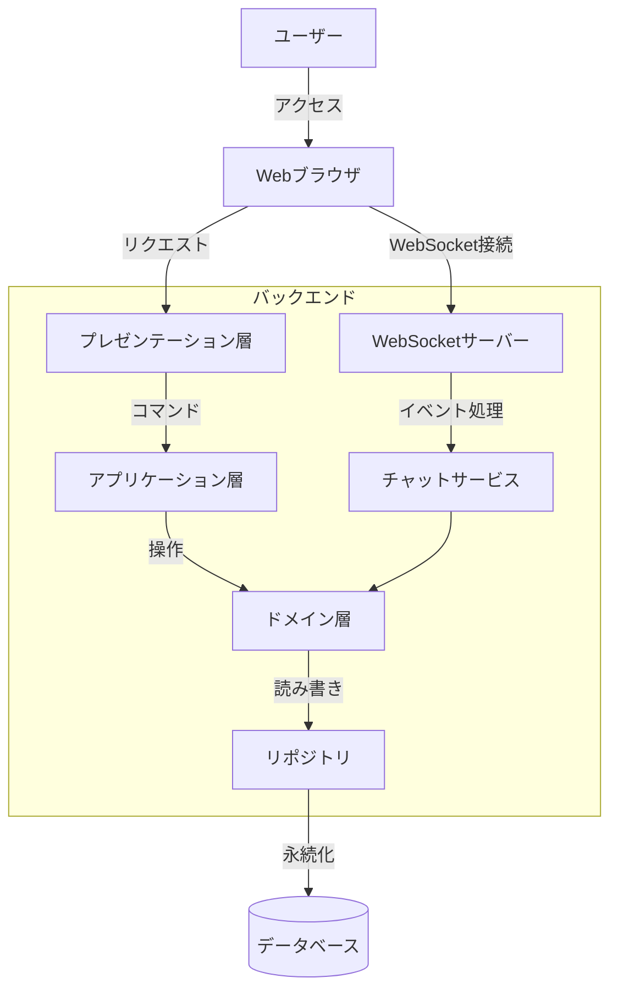

# システムアーキテクチャ設計

## 全体アーキテクチャ



## レイヤー構成

本アプリケーションは以下のレイヤー構成に従い、関心の分離を実現します。

### 1. プレゼンテーション層
- **コントローラー**: HTTPリクエストの処理とレスポンスの生成
- **ビュー**: Thymeleafテンプレートを使用したHTML生成
- **フォーム**: ユーザー入力データの受け取りと検証

### 2. アプリケーション層
- **サービス**: ユースケースの実装、トランザクション制御
- **DTO**: データ転送オブジェクト、レイヤー間のデータ交換

### 3. ドメイン層
- **エンティティ**: ビジネスドメインモデル
- **値オブジェクト**: 不変なドメイン要素
- **ドメインサービス**: エンティティ横断的な操作

### 4. インフラストラクチャ層
- **リポジトリ実装**: データアクセスロジック
- **外部サービス連携**: メール送信、ファイルストレージなど

## 技術スタック

### フロントエンド
- **テンプレートエンジン**: Thymeleaf
- **CSS**: Bootstrap 5
- **JavaScript**: jQuery, SockJS, STOMP

### バックエンド
- **言語**: Kotlin 1.9.25
- **フレームワーク**: Spring Boot 3.4.4
- **セキュリティ**: Spring Security
- **リアルタイム通信**: Spring WebSocket

### データストア
- **RDBMS**: H2 Database (開発環境), PostgreSQL (本番環境)
- **キャッシュ**: Spring Cache + Caffeine

### 開発ツール
- **ビルドツール**: Gradle (Kotlin DSL)
- **テスト**: JUnit 5, MockK
- **CI/CD**: GitHub Actions

## モジュール構成

パッケージ構成は以下のドメイン中心の構造とします:

```
com.example.kotlin_thymeleaf_demo
├── application          # アプリケーション層
│   ├── config           # アプリケーション設定
│   └── security         # セキュリティ設定
├── domain               # ドメイン層（各機能ごとのサブパッケージ）
│   ├── user             # ユーザー関連
│   ├── post             # 投稿関連
│   ├── chat             # チャット関連
│   └── notification     # 通知関連
├── infrastructure       # インフラストラクチャ層
│   ├── repository       # リポジトリ実装
│   └── storage          # ファイルストレージ
└── presentation         # プレゼンテーション層
    ├── controller       # コントローラー
    ├── form             # フォーム
    └── advice           # コントローラーアドバイス
```

## 認証・認可設計

Spring Securityを使用し、以下の認証・認可機能を実装します:

1. **認証方式**: フォームベース認証
2. **セッション管理**: HTTPセッション
3. **パスワード管理**: BCryptパスワードエンコーダー
4. **CSRF対策**: Spring SecurityのCSRFトークン
5. **権限制御**: ロールベースのアクセス制御（RBAC）

## キャッシュ戦略

パフォーマンス向上のため、以下の要素をキャッシュします:

1. **投稿一覧**: 一定時間（5分）または更新時にキャッシュ無効化
2. **ユーザープロフィール**: 更新時にキャッシュ無効化
3. **カテゴリ・タグ情報**: アプリケーション起動時にロード

## エラーハンドリング

エラーハンドリングは以下の方針で実装します:

1. **グローバルエラーハンドラー**: ControllerAdviceによる一元的な例外ハンドリング
2. **エラーページ**: カスタムエラーページの提供（404, 403, 500など）
3. **バリデーションエラー**: フォームバリデーションエラーのフィードバック
4. **APIエラー**: 構造化されたJSONレスポンスでのエラー返却

## スケーラビリティ設計

将来的なスケールに備え、以下の設計を取り入れます:

1. **ステートレスサーバー**: セッション情報の外部化
2. **水平スケーリング**: 複数インスタンスでの負荷分散
3. **WebSocketクラスタリング**: メッセージブローカーを使用した分散型WebSocket

## セキュリティ設計

セキュリティリスクに対処するため、以下の対策を実装します:

1. **入力検証**: サーバーサイドでの厳格な入力検証
2. **XSS対策**: HTMLエスケープとContent Security Policy
3. **SQLインジェクション対策**: パラメータ化クエリの使用
4. **認証強化**: 失敗回数制限、パスワード強度要件
5. **アクセス制御**: 適切な認可チェック
