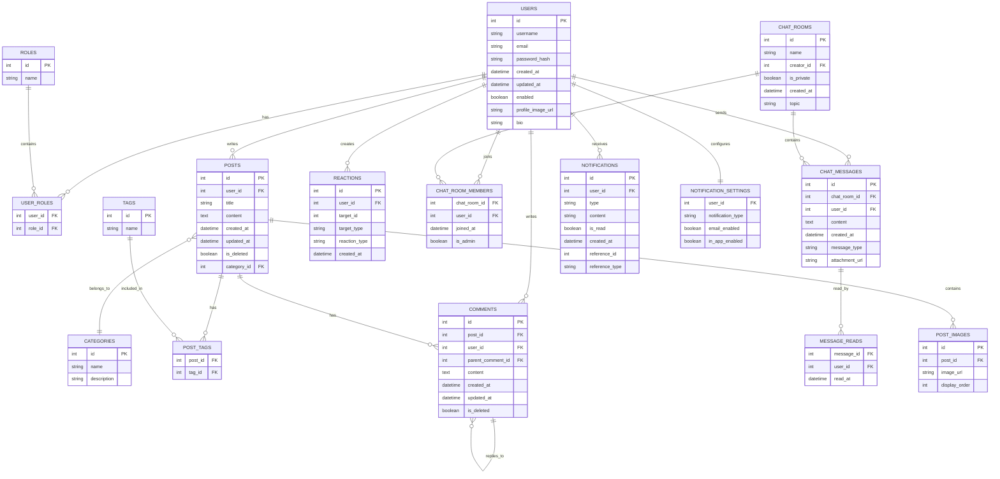

# データベース設計

## ER図



## テーブル定義

### users テーブル
| カラム名 | 型 | NULL | 制約 | 説明 |
|---------|------|------|------|------|
| id | INTEGER | NO | PK, AUTO_INCREMENT | ユーザーID |
| username | VARCHAR(50) | NO | UNIQUE | ユーザー名 |
| email | VARCHAR(100) | NO | UNIQUE | メールアドレス |
| password_hash | VARCHAR(100) | NO | | パスワードハッシュ |
| created_at | DATETIME | NO | | 作成日時 |
| updated_at | DATETIME | NO | | 更新日時 |
| enabled | BOOLEAN | NO | DEFAULT TRUE | アカウント有効フラグ |
| profile_image_url | VARCHAR(255) | YES | | プロフィール画像URL |
| bio | TEXT | YES | | 自己紹介 |

### roles テーブル
| カラム名 | 型 | NULL | 制約 | 説明 |
|---------|------|------|------|------|
| id | INTEGER | NO | PK, AUTO_INCREMENT | ロールID |
| name | VARCHAR(20) | NO | UNIQUE | ロール名 |

### user_roles テーブル
| カラム名 | 型 | NULL | 制約 | 説明 |
|---------|------|------|------|------|
| user_id | INTEGER | NO | FK(users.id) | ユーザーID |
| role_id | INTEGER | NO | FK(roles.id) | ロールID |

### posts テーブル
| カラム名 | 型 | NULL | 制約 | 説明 |
|---------|------|------|------|------|
| id | INTEGER | NO | PK, AUTO_INCREMENT | 投稿ID |
| user_id | INTEGER | NO | FK(users.id) | 投稿者ID |
| title | VARCHAR(200) | NO | | 投稿タイトル |
| content | TEXT | NO | | 投稿内容 |
| created_at | DATETIME | NO | | 作成日時 |
| updated_at | DATETIME | NO | | 更新日時 |
| is_deleted | BOOLEAN | NO | DEFAULT FALSE | 削除フラグ |
| category_id | INTEGER | YES | FK(categories.id) | カテゴリID |

### categories テーブル
| カラム名 | 型 | NULL | 制約 | 説明 |
|---------|------|------|------|------|
| id | INTEGER | NO | PK, AUTO_INCREMENT | カテゴリID |
| name | VARCHAR(50) | NO | UNIQUE | カテゴリ名 |
| description | VARCHAR(255) | YES | | カテゴリ説明 |

### tags テーブル
| カラム名 | 型 | NULL | 制約 | 説明 |
|---------|------|------|------|------|
| id | INTEGER | NO | PK, AUTO_INCREMENT | タグID |
| name | VARCHAR(30) | NO | UNIQUE | タグ名 |

### post_tags テーブル
| カラム名 | 型 | NULL | 制約 | 説明 |
|---------|------|------|------|------|
| post_id | INTEGER | NO | FK(posts.id) | 投稿ID |
| tag_id | INTEGER | NO | FK(tags.id) | タグID |

### comments テーブル
| カラム名 | 型 | NULL | 制約 | 説明 |
|---------|------|------|------|------|
| id | INTEGER | NO | PK, AUTO_INCREMENT | コメントID |
| post_id | INTEGER | NO | FK(posts.id) | 投稿ID |
| user_id | INTEGER | NO | FK(users.id) | コメント投稿者ID |
| parent_comment_id | INTEGER | YES | FK(comments.id) | 親コメントID |
| content | TEXT | NO | | コメント内容 |
| created_at | DATETIME | NO | | 作成日時 |
| updated_at | DATETIME | NO | | 更新日時 |
| is_deleted | BOOLEAN | NO | DEFAULT FALSE | 削除フラグ |

### reactions テーブル
| カラム名 | 型 | NULL | 制約 | 説明 |
|---------|------|------|------|------|
| id | INTEGER | NO | PK, AUTO_INCREMENT | リアクションID |
| user_id | INTEGER | NO | FK(users.id) | ユーザーID |
| target_id | INTEGER | NO | | 対象ID |
| target_type | VARCHAR(20) | NO | | 対象タイプ(post/comment) |
| reaction_type | VARCHAR(20) | NO | | リアクションタイプ(like/great/helpful) |
| created_at | DATETIME | NO | | 作成日時 |

### chat_rooms テーブル
| カラム名 | 型 | NULL | 制約 | 説明 |
|---------|------|------|------|------|
| id | INTEGER | NO | PK, AUTO_INCREMENT | チャットルームID |
| name | VARCHAR(100) | NO | | チャットルーム名 |
| creator_id | INTEGER | NO | FK(users.id) | 作成者ID |
| is_private | BOOLEAN | NO | DEFAULT FALSE | 非公開フラグ |
| created_at | DATETIME | NO | | 作成日時 |
| topic | VARCHAR(255) | YES | | トピック |

### chat_room_members テーブル
| カラム名 | 型 | NULL | 制約 | 説明 |
|---------|------|------|------|------|
| chat_room_id | INTEGER | NO | FK(chat_rooms.id) | チャットルームID |
| user_id | INTEGER | NO | FK(users.id) | ユーザーID |
| joined_at | DATETIME | NO | | 参加日時 |
| is_admin | BOOLEAN | NO | DEFAULT FALSE | 管理者フラグ |

### chat_messages テーブル
| カラム名 | 型 | NULL | 制約 | 説明 |
|---------|------|------|------|------|
| id | INTEGER | NO | PK, AUTO_INCREMENT | メッセージID |
| chat_room_id | INTEGER | NO | FK(chat_rooms.id) | チャットルームID |
| user_id | INTEGER | NO | FK(users.id) | 送信者ID |
| content | TEXT | NO | | メッセージ内容 |
| created_at | DATETIME | NO | | 送信日時 |
| message_type | VARCHAR(20) | NO | DEFAULT 'TEXT' | メッセージタイプ(text/image/file) |
| attachment_url | VARCHAR(255) | YES | | 添付ファイルURL |

### message_reads テーブル
| カラム名 | 型 | NULL | 制約 | 説明 |
|---------|------|------|------|------|
| message_id | INTEGER | NO | FK(chat_messages.id) | メッセージID |
| user_id | INTEGER | NO | FK(users.id) | ユーザーID |
| read_at | DATETIME | NO | | 既読日時 |

### notifications テーブル
| カラム名 | 型 | NULL | 制約 | 説明 |
|---------|------|------|------|------|
| id | INTEGER | NO | PK, AUTO_INCREMENT | 通知ID |
| user_id | INTEGER | NO | FK(users.id) | 通知先ユーザーID |
| type | VARCHAR(50) | NO | | 通知タイプ |
| content | TEXT | NO | | 通知内容 |
| is_read | BOOLEAN | NO | DEFAULT FALSE | 既読フラグ |
| created_at | DATETIME | NO | | 作成日時 |
| reference_id | INTEGER | YES | | 参照ID |
| reference_type | VARCHAR(20) | YES | | 参照タイプ |

### notification_settings テーブル
| カラム名 | 型 | NULL | 制約 | 説明 |
|---------|------|------|------|------|
| user_id | INTEGER | NO | FK(users.id) | ユーザーID |
| notification_type | VARCHAR(50) | NO | | 通知タイプ |
| email_enabled | BOOLEAN | NO | DEFAULT TRUE | メール通知有効フラグ |
| in_app_enabled | BOOLEAN | NO | DEFAULT TRUE | アプリ内通知有効フラグ |

### post_images テーブル
| カラム名 | 型 | NULL | 制約 | 説明 |
|---------|------|------|------|------|
| id | INTEGER | NO | PK, AUTO_INCREMENT | 画像ID |
| post_id | INTEGER | NO | FK(posts.id) | 投稿ID |
| image_url | VARCHAR(255) | NO | | 画像URL |
| display_order | INTEGER | NO | DEFAULT 0 | 表示順序 |

## インデックス設計

パフォーマンス最適化のため、以下のインデックスを作成します。

### users テーブル
- users_email_idx (email)
- users_username_idx (username)

### posts テーブル
- posts_user_id_idx (user_id)
- posts_category_id_idx (category_id)
- posts_created_at_idx (created_at)

### comments テーブル
- comments_post_id_idx (post_id)
- comments_user_id_idx (user_id)
- comments_parent_comment_id_idx (parent_comment_id)

### reactions テーブル
- reactions_user_id_target_idx (user_id, target_id, target_type)

### chat_messages テーブル
- chat_messages_room_id_created_at_idx (chat_room_id, created_at)

### notifications テーブル
- notifications_user_id_is_read_idx (user_id, is_read)

## 初期データ

システムの初期動作に必要な最小限のマスターデータを定義します。

### roles テーブル
```sql
INSERT INTO roles (name) VALUES ('ROLE_USER');
INSERT INTO roles (name) VALUES ('ROLE_ADMIN');
```

### categories テーブル
```sql
INSERT INTO categories (name, description) VALUES ('全般', '一般的な話題');
INSERT INTO categories (name, description) VALUES ('質問', '質問や相談');
INSERT INTO categories (name, description) VALUES ('お知らせ', 'お知らせや通知');
```

### chat_rooms テーブル（公開チャットルーム）
```sql
-- 管理者ユーザーが作成する前提
INSERT INTO chat_rooms (name, creator_id, is_private, created_at, topic) 
VALUES ('公開チャットルーム', 1, FALSE, CURRENT_TIMESTAMP, '自由に話し合いましょう');
```
