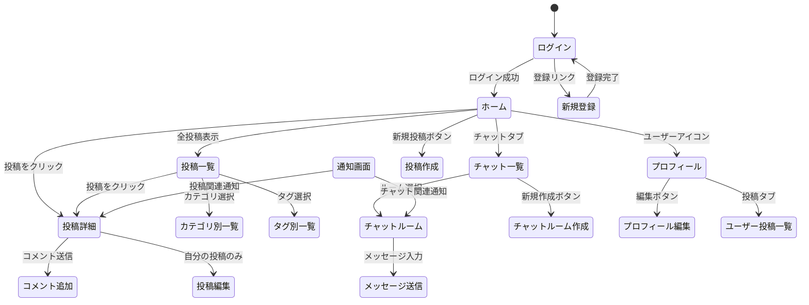

# ユーザーインターフェース設計

## 画面遷移図



## 主要画面レイアウト

### 1. ホーム画面

```
+---------------------------------+
|  ロゴ  検索      通知 ユーザー  |
+---------------------------------+
| サイド  |                       |
| バー    |  最新投稿一覧         |
| (カテゴ |  +------------------+ |
| リ一覧  |  | 投稿カード1      | |
| /タグ   |  +------------------+ |
| /アクテ |                       |
| ィブな  |  +------------------+ |
| チャット|  | 投稿カード2      | |
| ルーム) |  +------------------+ |
|         |                       |
|         |  +------------------+ |
|         |  | 投稿カード3      | |
|         |  +------------------+ |
|         |                       |
+---------+-----------------------+
|           フッター             |
+---------------------------------+
```

### 2. 投稿詳細画面

```
+---------------------------------+
|  ロゴ  検索      通知 ユーザー  |
+---------------------------------+
| サイド  |                       |
| バー    |  投稿タイトル         |
|         |  投稿者 カテゴリ 日時 |
|         |  +------------------+ |
|         |  | 投稿内容         | |
|         |  |                  | |
|         |  |                  | |
|         |  +------------------+ |
|         |  リアクションボタン   |
|         |                       |
|         |  コメント一覧         |
|         |  +------------------+ |
|         |  | コメント1        | |
|         |  +------------------+ |
|         |  | コメント2        | |
|         |  +------------------+ |
|         |                       |
|         |  コメント入力欄       |
|         |  [送信]               |
+---------+-----------------------+
|           フッター             |
+---------------------------------+
```

### 3. チャットルーム画面

```
+---------------------------------+
|  ロゴ  検索      通知 ユーザー  |
+---------------------------------+
| チャット|                       |
| ルーム  |  チャットルーム名     |
| 一覧    |  参加者情報           |
|         |  +------------------+ |
| [ルーム1]|  | メッセージ履歴   | |
| [ルーム2]|  |                  | |
| [ルーム3]|  | ユーザーA: こんにちは | |
|         |  |                  | |
|         |  | あなた: よろしくお願いします | |
|         |  |                  | |
|         |  | ユーザーB: お疲れ様です | |
|         |  |                  | |
|         |  +------------------+ |
|         |                       |
|         |  メッセージ入力欄     |
|         |  [添付] [絵文字] [送信] |
+---------+-----------------------+
|           フッター             |
+---------------------------------+
```

### 4. ユーザープロフィール画面

```
+---------------------------------+
|  ロゴ  検索      通知 ユーザー  |
+---------------------------------+
|                                 |
|  +-----------------------------+ |
|  | プロフィール画像            | |
|  | ユーザー名                  | |
|  | 自己紹介                    | |
|  | 登録日: XXXX年XX月XX日      | |
|  | [プロフィール編集]          | |
|  +-----------------------------+ |
|                                 |
|  [投稿] [コメント] [いいね]     |
|  +-----------------------------+ |
|  | ユーザーの投稿一覧          | |
|  | +-------------------------+ | |
|  | | 投稿1                  | | |
|  | +-------------------------+ | |
|  | | 投稿2                  | | |
|  | +-------------------------+ | |
|  +-----------------------------+ |
|                                 |
+---------------------------------+
|           フッター             |
+---------------------------------+
```

### 5. ログイン画面

```
+---------------------------------+
|  ロゴ                           |
+---------------------------------+
|                                 |
|  +-----------------------------+ |
|  |        ログイン            | |
|  |                             | |
|  | メールアドレス:             | |
|  | [                    ]      | |
|  |                             | |
|  | パスワード:                 | |
|  | [                    ]      | |
|  |                             | |
|  | [ログイン]                  | |
|  |                             | |
|  | アカウントをお持ちでない方は | |
|  | [新規登録]                  | |
|  |                             | |
|  | [パスワードをお忘れの方]     | |
|  +-----------------------------+ |
|                                 |
+---------------------------------+
|           フッター             |
+---------------------------------+
```

## モバイルレスポンシブ対応

レスポンシブデザインの基本方針は以下の通りです：

1. **モバイルファースト設計**: 小さい画面サイズを基準に設計し、大きな画面へ拡張
2. **フレキシブルグリッド**: パーセント単位のレイアウト
3. **メディアクエリ**:
   - 小型デバイス（スマートフォン）: 576px未満
   - 中型デバイス（タブレット）: 576px～768px
   - 大型デバイス（デスクトップ）: 768px以上

### モバイル対応の主な変更点

1. **ナビゲーション**: ハンバーガーメニューへの変換
2. **サイドバー**: 折りたたみ可能なドロワーメニューに変更
3. **投稿カード**: 1列表示に変更
4. **チャットルーム**: ルーム一覧と会話画面を別画面に分離
5. **フォーム**: 入力フィールドを画面幅に合わせて拡大

## アクセシビリティ対応

以下のアクセシビリティ対応を実施します：

1. **セマンティックHTML**: 適切なHTML5要素の使用
2. **ARIAランドマーク**: 適切なロール属性の付与
3. **コントラスト比**: WCAG AAレベル以上のコントラスト比確保
4. **フォーカスインジケータ**: キーボード操作時の視覚的フィードバック
5. **代替テキスト**: すべての画像に対するalt属性の設定
6. **フォームラベル**: すべての入力フィールドに対するラベルの設定

## UIフレームワーク

UI実装にはBootstrap 5を採用し、以下のコンポーネントを活用します：

1. **ナビゲーションバー**: ヘッダーメニュー
2. **カード**: 投稿表示
3. **フォーム**: ユーザー入力
4. **モーダル**: ポップアップダイアログ
5. **トースト**: 通知表示
6. **タブ**: コンテンツ切り替え
7. **バッジ**: 未読通知などの表示

## スタイルガイド

### 1. 色彩設計

主要カラーパレット：

- **プライマリカラー**: #3498db（青）
- **セカンダリカラー**: #2ecc71（緑）
- **アクセントカラー**: #e74c3c（赤）
- **ベースカラー**: #f8f9fa（薄いグレー）
- **テキストカラー**: #333333（濃いグレー）

### 2. タイポグラフィ

- **見出し**: Roboto, sans-serif
- **本文**: Open Sans, sans-serif
- **ベースサイズ**: 16px
- **見出しサイズ**:
  - H1: 2.5rem
  - H2: 2rem
  - H3: 1.75rem
  - H4: 1.5rem

### 3. コンポーネント

- **ボタン**:
  - プライマリ: 青背景、白文字
  - セカンダリ: 白背景、青枠、青文字
  - 危険: 赤背景、白文字
  - サイズ: S, M（デフォルト）, L

- **フォーム**:
  - 角丸入力フィールド
  - フォーカス時の青色ハイライト
  - 検証エラー時の赤色ハイライト

- **カード**:
  - 白背景、薄いシャドウ
  - 8pxの角丸
  - 16pxの内部パディング
