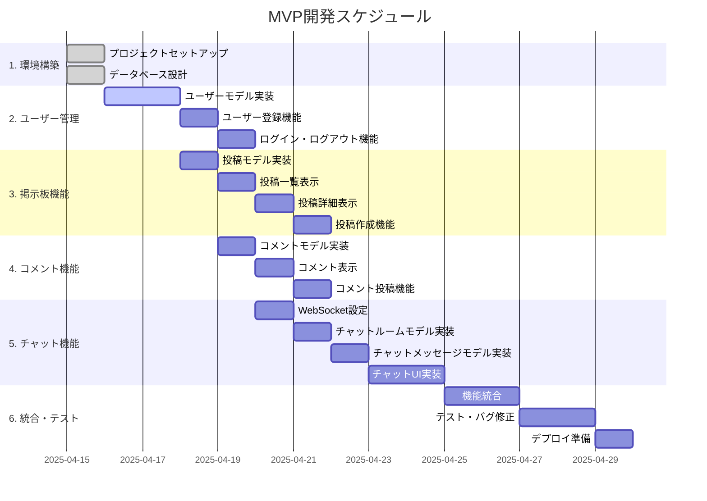

# 開発ワークフロー設計

## MVPの実装計画

MVP（最小実行可能製品）として、まずは以下の機能を優先的に実装します：

1. 基本的なユーザー登録・認証
2. シンプルな投稿と閲覧機能
3. 基本的なコメント機能
4. 公開チャットルーム（1つのみ）でのテキストメッセージング

## 実装ガントチャート

## エージェント向け実装ガイド

各機能の実装を効率的に進めるため、機能ごとに最小限の情報でタスクを完了できるようにします。以下は、エージェントが各タスクを完了するために必要な情報と実装手順です。

### 1. ユーザー管理機能の実装

#### 必要な情報
- ユーザーのエンティティ定義（フィールド、バリデーション）
- Spring Securityの基本設定

#### 実装手順
1. User エンティティクラスの作成
2. UserRepository インターフェースの作成
3. UserService の実装
4. SecurityConfig の設定
5. 登録・ログイン用コントローラーとビューの作成

### 2. 投稿機能の実装

#### 必要な情報
- 投稿エンティティの定義
- 投稿フォームのフィールド
- 投稿一覧・詳細ページのレイアウト

#### 実装手順
1. Post エンティティクラスの作成
2. PostRepository インターフェースの作成
3. PostService の実装
4. 投稿関連コントローラーの作成
5. 投稿一覧・詳細・作成ビューの実装

### 3. コメント機能の実装

#### 必要な情報
- コメントエンティティの定義
- コメントフォームのフィールド
- コメント表示のレイアウト

#### 実装手順
1. Comment エンティティクラスの作成
2. CommentRepository インターフェースの作成
3. CommentService の実装
4. コメント関連コントローラーメソッドの追加
5. コメント表示・投稿用ビューコンポーネントの実装

### 4. チャット機能の実装

#### 必要な情報
- WebSocketの基本設定
- チャットルーム・メッセージエンティティの定義
- チャットUIのレイアウト

#### 実装手順
1. WebSocket設定クラスの作成
2. ChatRoom および ChatMessage エンティティクラスの作成
3. ChatRepository インターフェースの作成
4. ChatService の実装
5. WebSocketコントローラーの作成
6. チャットルーム・メッセージビューの実装
7. JavaScriptでのWebSocket通信処理の実装

## ドメイン別実装モジュール

各ドメインは、可能な限り独立したモジュールとして実装し、各モジュールには以下の要素を含めます：

### ユーザー管理モジュール
- `domain.user`: エンティティとドメインロジック
- `infrastructure.repository.user`: データアクセス層
- `application.service.user`: アプリケーションサービス
- `presentation.controller.user`: コントローラー
- `presentation.form.user`: フォーム
- `resources/templates/user`: ビュー

### 投稿モジュール
- `domain.post`: エンティティとドメインロジック
- `infrastructure.repository.post`: データアクセス層
- `application.service.post`: アプリケーションサービス
- `presentation.controller.post`: コントローラー
- `presentation.form.post`: フォーム
- `resources/templates/post`: ビュー

### コメントモジュール
- `domain.comment`: エンティティとドメインロジック
- `infrastructure.repository.comment`: データアクセス層
- `application.service.comment`: アプリケーションサービス
- `presentation.controller.comment`: コントローラーメソッド（PostControllerに含める）
- `presentation.form.comment`: フォーム
- `resources/templates/fragments/comment`: ビューフラグメント

### チャットモジュール
- `domain.chat`: エンティティとドメインロジック
- `infrastructure.repository.chat`: データアクセス層
- `application.service.chat`: アプリケーションサービス
- `presentation.controller.chat`: コントローラー
- `presentation.form.chat`: フォーム
- `resources/templates/chat`: ビュー
- `resources/static/js/chat.js`: フロントエンド処理

## テスト戦略

各レイヤーに対して以下のテストを実装します：

1. **ドメイン層テスト**: ドメインモデル・ロジックのユニットテスト
2. **リポジトリテスト**: データアクセス層のテスト（H2インメモリDBを使用）
3. **サービス層テスト**: アプリケーションサービスのユニットテスト（Mockito/MockKを使用）
4. **コントローラーテスト**: エンドポイントのテスト（MockMvcを使用）
5. **統合テスト**: 主要ユースケースのエンドツーエンドテスト

## MVP以降の拡張計画

MVPの完成後、以下の順序で機能を拡張していきます：

### フェーズ2
1. 投稿へのリアクション機能
2. 画像アップロード機能
3. マルチチャットルーム
4. 通知機能

### フェーズ3
1. 非公開チャットルーム
2. 高度な検索機能
3. ファイル共有機能
4. モバイル最適化
